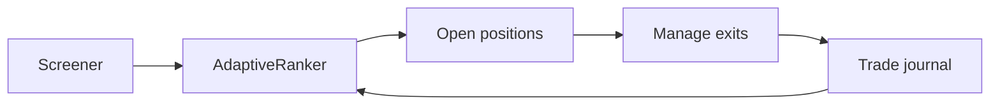
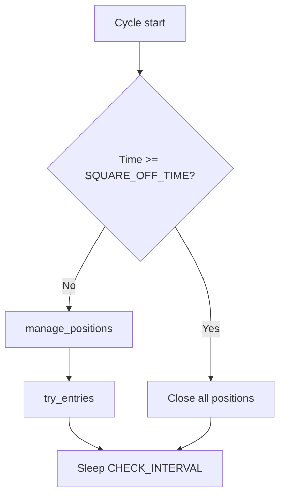
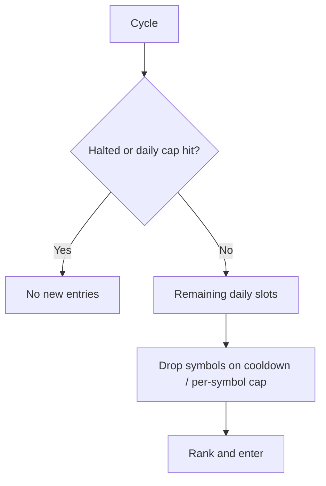
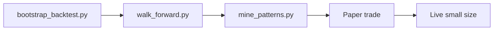
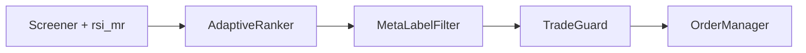

# User Guide — Intraday RSI+Volume Agent (Angel One)

This guide explains how to install, configure, run, and monitor the autonomous intraday trading agent. It covers the core RSI+volume strategy, paper vs live trading, and the optional adaptive learning layer for symbol selection.

For a quick start, see [README.md](README.md). For developer/AI agent notes, see [AGENTS.md](AGENTS.md).

---

## Table of contents

1. [What this system does](#1-what-this-system-does)
2. [Prerequisites](#2-prerequisites)
3. [Installation](#3-installation)
4. [Angel One SmartAPI setup](#4-angel-one-smartapi-setup)
5. [Configuration reference](#5-configuration-reference)
6. [Running the agent](#6-running-the-agent)
7. [How each trading cycle works](#7-how-each-trading-cycle-works)
8. [Strategy rules in detail](#8-strategy-rules-in-detail)
9. [Symbol selection (with and without learning)](#9-symbol-selection-with-and-without-learning)
9b. [Anti-overtrading guards](#9b-anti-overtrading-guards)
10. [Adaptive learning layer](#10-adaptive-learning-layer)
11. [Bootstrap backtest](#11-bootstrap-backtest)
11b. [Backtesting learnings](#11b-backtesting-learnings)
11c. [Walk-forward validation](#11c-walk-forward-validation)
11d. [Meta-label trade filter](#11d-meta-label-trade-filter)
11e. [Offline candle cache & Phase B research](#11e-offline-candle-cache--phase-b-research)
11f. [Four-strategy research bake-off](#11f-four-strategy-research-bake-off)
11g. [Refinement roadmap (Tiers 1–4)](#11g-refinement-roadmap-tiers-14)
12. [Trade journal and analysis tools](#12-trade-journal-and-analysis-tools)
13. [Logs and monitoring](#13-logs-and-monitoring)
14. [Paper-to-live checklist](#14-paper-to-live-checklist)
15. [Troubleshooting](#15-troubleshooting)
16. [FAQ](#16-faq)
17. [Disclaimer](#17-disclaimer)

---

## 1. What this system does

The agent runs continuously during Indian market hours (09:15–15:30 IST, weekdays). On each cycle it:

1. **Screens** all Nifty 50 stocks on **15-minute candles**
2. **Finds** RSI extremes confirmed by volume (within optional min/max volume band)
3. **Filters** entries through optional **India VIX** regime gate and other tunables
4. **Enters** mean-reversion trades as **NSE intraday MIS** (short-only in the tuned profile)
5. **Manages** exits with ATR stop/target, ATR trailing stop, RSI mid-line, and EOD square-off
6. **Optionally learns** from past trade outcomes to rank and filter which symbols to trade

**Paper trading is the default.** No real orders are sent unless you explicitly set `LIVE_TRADING=true`.

After backtesting on five Nifty names over ~60–80 days, the **tuned profile** uses short-only entries, ATR exits, trailing stops, and a VIX ceiling. See [§11b Backtesting learnings](#11b-backtesting-learnings).



---

## 2. Prerequisites

| Requirement | Details |
|-------------|---------|
| Python | 3.9 or newer |
| OS | Linux, macOS, or WSL (tested on Linux) |
| Broker | Angel One account with SmartAPI enabled |
| Network | Stable internet during market hours |
| Time zone | System clock should be accurate (agent uses IST for market hours) |

You need four Angel credentials (see next section): API key, client ID, password, and TOTP secret.

---

## 3. Installation

From the project root:

```bash
cd /home/acharya/trading/Auto_trading
python3 -m venv venv
source venv/bin/activate    # Windows: venv\Scripts\activate
pip install -r requirements.txt
cp .env.example .env
```

Edit `.env` with your Angel credentials and preferred settings (see [Configuration reference](#5-configuration-reference)).

Verify setup:

```bash
python tools/status.py
```

You should see `[OK]` for the package, entry script, and `.env`. Fix any `[FAIL]` items before running the agent.

---

## 4. Angel One SmartAPI setup

1. **Create a SmartAPI app** at [https://smartapi.angelbroking.com/](https://smartapi.angelbroking.com/)
2. Note your **API key**
3. Use your Angel **client ID** (login ID) and **password**
4. Enable **TOTP** on your Angel account and save the **TOTP secret** (the base32 string used by authenticator apps — not the 6-digit code)

Add these to `.env`:

```env
ANGEL_API_KEY=your_api_key_here
ANGEL_CLIENT_ID=your_client_id_here
ANGEL_PASSWORD=your_password_here
ANGEL_TOTP_SECRET=your_totp_secret_here
```

**Security:** Never commit `.env` or share credentials. The file is gitignored by default.

On first run, the agent downloads and caches the NSE scrip master to `data/instruments.json` for symbol-to-token lookup. This cache refreshes based on `INSTRUMENTS_CACHE_MAX_AGE_HOURS` (default 24 hours).

---

## 5. Configuration reference

All settings are loaded from `.env` via `intraday_agent/config.py`. Copy defaults from `.env.example`.

### Angel credentials

| Variable | Required | Description |
|----------|----------|-------------|
| `ANGEL_API_KEY` | Yes | SmartAPI application key |
| `ANGEL_CLIENT_ID` | Yes | Angel client/login ID |
| `ANGEL_PASSWORD` | Yes | Angel login password |
| `ANGEL_TOTP_SECRET` | Yes | TOTP base32 secret for 2FA |

### Execution mode

| Variable | Default | Description |
|----------|---------|-------------|
| `LIVE_TRADING` | `false` | `true` = place real MIS orders; `false` = paper (simulated) |
| `ALLOW_SHORT` | `true` | Allow short entries on overbought signals |
| `ALLOW_LONG` | `true` | Allow long entries on oversold signals (`false` recommended after backtests) |

### Position sizing

| Variable | Default | Description |
|----------|---------|-------------|
| `CAPITAL_PER_TRADE` | `25000` | Rupees allocated per trade |
| `MAX_QUANTITY` | `100` | Hard cap on shares per order |
| `MAX_POSITIONS` | `3` | Maximum concurrent open positions |

**Quantity formula:** `quantity = max(1, min(floor(CAPITAL_PER_TRADE / LTP), MAX_QUANTITY))`

Example: at ₹2,500 LTP with `CAPITAL_PER_TRADE=25000`, quantity = 10 shares.

### RSI strategy

| Variable | Default | Description |
|----------|---------|-------------|
| `RSI_PERIOD` | `14` | RSI lookback (Wilder-style EWM) |
| `RSI_OVERSOLD` | `30` | Long entry when RSI below this |
| `RSI_OVERBOUGHT` | `70` | Short entry when RSI above this |
| `RSI_EXIT` | `50` | Exit long when RSI ≥ this; exit short when RSI ≤ this |

### Volume confirmation

| Variable | Default | Description |
|----------|---------|-------------|
| `VOLUME_MA_LEN` | `20` | SMA length for volume baseline |
| `VOLUME_MA_MULT` | `1.0` | Signal candle volume must exceed `SMA × mult` |
| `VOLUME_MA_MAX_MULT` | `2.0` | Skip entry if volume exceeds this × SMA (`0` = no cap) |

### Timing and candles

| Variable | Default | Description |
|----------|---------|-------------|
| `CANDLE_INTERVAL` | `FIFTEEN_MINUTE` | Angel candle interval |
| `CANDLE_LOOKBACK` | `100` | Bars fetched per symbol per request |
| `CHECK_INTERVAL` | `90` | Seconds between agent cycles |
| `SQUARE_OFF_TIME` | `15:15` | Force-close all positions at/after this IST time |
| `ENTRY_CUTOFF_TIME` | `14:30` | No new entries at/after this IST time (empty = disabled) |
| `SCREENER_DELAY_SEC` | `0.3` | Delay between symbol API calls (rate limiting) |

### Risk and exits

| Variable | Default | Description |
|----------|---------|-------------|
| `STOP_LOSS_PCT` | `1.5` | Fixed-% stop (used when `USE_ATR_EXITS=false`) |
| `TARGET_PCT` | `2.5` | Fixed-% target (used when `USE_ATR_EXITS=false`) |
| `USE_ATR_EXITS` | `true` | Use ATR-based stop and target instead of fixed % |
| `ATR_PERIOD` | `14` | ATR lookback (Wilder-style EWM on true range) |
| `ATR_STOP_MULT` | `1.5` | Stop distance = entry ATR × this |
| `ATR_TARGET_MULT` | `3.0` | Target distance = entry ATR × this |
| `TRAILING_STOP_ENABLED` | `false` | Enable ATR trailing stop after activation threshold |
| `TRAILING_ACTIVATION_ATR_MULT` | `1.0` | Start trailing after profit reaches this × entry ATR |
| `TRAILING_STOP_ATR_MULT` | `1.0` | Trail distance from peak/trough in ATR units |
| `TRAILING_ACTIVATION_PCT` | `0.5` | Trailing activation fallback when ATR exits off (%) |
| `TRAILING_STOP_PCT` | `0.8` | Trailing distance fallback when ATR exits off (%) |

### VWAP filters (optional)

| Variable | Default | Description |
|----------|---------|-------------|
| `VWAP_FILTER_ENABLED` | `true` | Long: close > session VWAP; short: close < session VWAP |
| `VWAP_EXIT_ENABLED` | `true` | Exit long below VWAP / short above VWAP (backtests: hurts net P&L) |

### Market regime (optional)

| Variable | Default | Description |
|----------|---------|-------------|
| `REGIME_FILTER_ENABLED` | `false` | Master switch for regime gates on short entries |
| `VIX_MAX` | `18` | Skip shorts when India VIX close > this (`0` = disable VIX gate) |
| `NIFTY_REGIME_ENABLED` | `true` | Require Nifty 50 close < EMA for shorts |
| `NIFTY_EMA_PERIOD` | `20` | EMA period on Nifty 15m candles for regime check |

### Commissions (net P&L)

| Variable | Default | Description |
|----------|---------|-------------|
| `ESTIMATED_COST_PER_TRADE` | `42` | Flat ₹ cost per completed round-trip for net P&L reports (`0` = Angel MIS formula) |

### Anti-overtrading guards

Set any value to `0` to disable that guard. See [Section 9b](#9b-anti-overtrading-guards) for full behavior.

| Variable | Default | Description |
|----------|---------|-------------|
| `MAX_TRADES_PER_DAY` | `10` | Hard cap on new entries per trading day |
| `MAX_TRADES_PER_SYMBOL` | `2` | Max entries for a single symbol per day |
| `SYMBOL_COOLDOWN_MIN` | `30` | Minutes to wait before re-entering a symbol after it closes |
| `LOSS_COOLDOWN_MIN` | `60` | Longer cooldown applied after a *losing* exit (revenge-trade guard) |
| `MAX_DAILY_LOSS` | `0` | Rupees; square off all + halt for the day when realized loss hits this |
| `MAX_DAILY_PROFIT` | `0` | Rupees; halt new entries once realized profit hits this |

### Adaptive learning

| Variable | Default | Description |
|----------|---------|-------------|
| `LEARNING_ENABLED` | `false` | Enable adaptive ranking and symbol filtering |
| `LEARNING_MIN_TRADES` | `10` | Minimum closed trades before a symbol can be skipped |
| `LEARNING_SKIP_WIN_RATE` | `0.40` | Skip symbol if win rate is below this (after min trades) |
| `LEARNING_SYMBOL_WEIGHT` | `20` | Weight applied to `(win_rate - 0.5)` in ranking score |
| `LEARNING_LOOKBACK_DAYS` | `30` | Rolling window for per-symbol stats |

### Meta-label trade filter

Optional **logistic regression** filter that runs **after** adaptive ranking and **before** order placement. It does **not** change RSI/volume entry rules — only skip/keep decisions on candidates the screener already found. Default **off** until walk-forward OOS passes on enough **paper** trades.

| Variable | Default | Description |
|----------|---------|-------------|
| `META_LABEL_ENABLED` | `false` | Apply trained model at entry time (paper/live) |
| `META_LABEL_THRESHOLD` | `0.55` | Minimum P(net profitable) to allow entry |
| `META_LABEL_MODEL_PATH` | `data/models/meta_label.joblib` | Saved sklearn pipeline artifact |

See [§11d](#11d-meta-label-trade-filter) for bootstrap → train → evaluate workflow.

### Research / backtest data source

Backtest and research tools **default to local parquet cache** — they do **not** call Angel unless you pass `--source angel`. The live paper agent uses `SCREENER_DATA_SOURCE` separately (often `yahoo`).

| Variable | Default | Description |
|----------|---------|-------------|
| `RESEARCH_DATA_SOURCE` | `cache` | `cache` = offline parquet; `angel` = SmartAPI fetch; `yahoo` = yfinance (~59d on 15m) |
| `CANDLE_CACHE_BACKEND` | `angel` | Which parquet store when `source=cache` (`data/candles/` vs `data/candles/yahoo/`) |
| `CANDLE_STORE_DIR` | `data/candles` | Angel prefetch destination |
| `CANDLE_STORE_MAX_AGE_HOURS` | `24` | Stale-cache refresh window when using `source=angel` |

See [§11e](#11e-offline-candle-cache--phase-b-research) for prefetch, bundles, and Phase B validation.

### Paths

| Variable | Default | Description |
|----------|---------|-------------|
| `DATA_DIR` | `data` | Directory for instruments cache and trade journal |
| `INSTRUMENTS_CACHE_MAX_AGE_HOURS` | `24` | Refresh scrip master after this many hours |
| `LOG_LEVEL` | `INFO` | Logging verbosity |

---

## 6. Running the agent

### Health check

```bash
python tools/status.py
```

### Paper mode (recommended first)

Ensure `.env` has `LIVE_TRADING=false` (default):

```bash
python run_agent.py
```

The agent logs in to Angel, loops during market hours, and simulates trades without placing real orders. Paper entries and closes appear in logs with `PAPER` prefix.

### Single cycle (testing)

Runs one scan/manage cycle then exits. Useful during market hours to verify signals without a long-running process:

```bash
python run_agent.py --once
```

If the market is closed, it prints `Market is closed.` and exits.

### Live trading

Only after thorough paper validation:

1. Set `LIVE_TRADING=true` in `.env`
2. Confirm sufficient broker margin for MIS intraday
3. Run:

```bash
python run_agent.py
```

Startup log shows `Starting IntradayAgent [LIVE mode]`.

### Stopping the agent

Press `Ctrl+C`. If positions are still open, the agent warns you to square off manually (it does not auto-close on interrupt).

---

## 7. How each trading cycle works

Every `CHECK_INTERVAL` seconds (default 90), while the market is open:



### Step 1 — End-of-day square-off

If current IST time ≥ `SQUARE_OFF_TIME` (default 15:15), all open positions are closed with reason `EOD square-off`. No new entries are taken in this cycle.

### Step 2 — Manage open positions

For each open position, the agent fetches latest candles and LTP, updates the **trailing extreme** (peak for longs, trough for shorts), then checks exits in this order:

1. **Trailing stop** (if enabled and activated)
2. **ATR stop / ATR target** (or fixed `STOP_LOSS_PCT` / `TARGET_PCT` when `USE_ATR_EXITS=false`)
3. **RSI mid-line exit** (`RSI_EXIT`)
4. **VWAP breakdown** (if `VWAP_EXIT_ENABLED=true`)

End-of-day square-off runs before entry logic when time ≥ `SQUARE_OFF_TIME`.

### Step 3 — Try new entries

If slots remain (`MAX_POSITIONS` minus current count) and guards allow:

1. **Regime check** — if `REGIME_FILTER_ENABLED=true`, skip all shorts when VIX > `VIX_MAX` and/or Nifty fails EMA test
2. Screener scans all Nifty 50 symbols (~15 seconds with default delay)
3. Adaptive ranker picks top candidates (or legacy ordering if learning off)
4. Agent opens up to `slots` new positions

---

## 8. Strategy rules in detail

The strategy lives in `intraday_agent/strategy.py` as `RsiVolumeMeanReversionStrategy`. It combines RSI+volume mean reversion with optional VWAP, ATR exits, and trailing stops.

### Entry conditions

| Side | RSI | Volume | Other filters | Action |
|------|-----|--------|---------------|--------|
| Long | RSI < `RSI_OVERSOLD` | `SMA × VOLUME_MA_MULT` ≤ vol ≤ `SMA × VOLUME_MA_MAX_MULT` | VWAP: close > session VWAP (if enabled); before `ENTRY_CUTOFF_TIME`; regime N/A | BUY MIS |
| Short | RSI > `RSI_OVERBOUGHT` | Same volume band | VWAP: close < session VWAP (if enabled); before cutoff; VIX ≤ `VIX_MAX`; optional Nifty < EMA | SELL MIS |

Both RSI and volume must be true on the **latest completed 15-minute bar** at scan time.

**Tuned thresholds (from backtests):** `RSI_OVERSOLD=28`, `RSI_OVERBOUGHT=75`, `VOLUME_MA_MULT=1.2`, `VOLUME_MA_MAX_MULT=2.0`, `ENTRY_CUTOFF_TIME=14:30`.

### Exit conditions

| Trigger | Condition |
|---------|-----------|
| Trailing stop | Profit ≥ `TRAILING_ACTIVATION_ATR_MULT` × entry ATR → trail at peak/trough ± `TRAILING_STOP_ATR_MULT` × ATR |
| ATR stop | Price hits entry ± `ATR_STOP_MULT` × entry ATR (fixed stop disabled once trailing active) |
| ATR target | Price hits entry ± `ATR_TARGET_MULT` × entry ATR |
| Fixed stop/target | Used when `USE_ATR_EXITS=false` |
| RSI exit | Long: RSI ≥ `RSI_EXIT`; Short: RSI ≤ `RSI_EXIT` |
| VWAP breakdown | Long below VWAP / short above VWAP (if `VWAP_EXIT_ENABLED`) |
| EOD | Time ≥ `SQUARE_OFF_TIME` |

Entry ATR is captured at open and used for stop/target/trailing distances for the life of the trade.

### Recommended tuned profile

These settings passed **walk-forward** out-of-sample validation on five test symbols (not a guarantee for live trading):

```env
ALLOW_LONG=false
RSI_OVERSOLD=28
RSI_OVERBOUGHT=75
VOLUME_MA_MULT=1.2
VOLUME_MA_MAX_MULT=2.0
ENTRY_CUTOFF_TIME=14:30
USE_ATR_EXITS=true
ATR_STOP_MULT=1.5
ATR_TARGET_MULT=3.0
TRAILING_STOP_ENABLED=true
TRAILING_ACTIVATION_ATR_MULT=1.0
TRAILING_STOP_ATR_MULT=1.0
VWAP_FILTER_ENABLED=false
VWAP_EXIT_ENABLED=false
REGIME_FILTER_ENABLED=true
VIX_MAX=18
NIFTY_REGIME_ENABLED=false
ESTIMATED_COST_PER_TRADE=42
```

### Watchlist

Symbols are defined in `intraday_agent/universe.py` (`NIFTY_50` list). Update this file when index constituents change.

---

## 9. Symbol selection (with and without learning)

When multiple symbols signal at once, the agent can only enter up to `MAX_POSITIONS` trades. Selection differs by mode.

### Legacy mode (`LEARNING_ENABLED=false` or empty journal)

1. Sort oversold candidates by **lowest RSI first** (most oversold)
2. Sort overbought candidates by **highest RSI first** (most overbought)
3. Append all longs, then all shorts
4. Take the first `slots` entries

**Note:** Longs are always considered before shorts in legacy mode.

### Adaptive mode (`LEARNING_ENABLED=true` with journal data)

1. Compute a **score** for each candidate (long and short together)
2. **Filter out** symbols with enough history and poor win rate
3. Sort by score descending
4. Take top `slots` entries

This fixes the long-first bias and prioritizes symbols with better historical outcomes.

---

## 9b. Anti-overtrading guards

Overtrading — taking too many trades, re-entering the same name repeatedly, or revenge-trading after a loss — is a common way to bleed capital through fees and slippage even when the strategy is sound. These guards sit **on top of** the strategy: they only ever *block* or *halt* entries; they never loosen stop-loss, target, or square-off rules.

All guards are configured in `.env` and a value of `0` disables that guard.

### The six guards

| Guard | Setting | What it prevents |
|-------|---------|------------------|
| Daily trade cap | `MAX_TRADES_PER_DAY` | Too many entries in one day |
| Per-symbol cap | `MAX_TRADES_PER_SYMBOL` | Churning a single stock |
| Symbol cooldown | `SYMBOL_COOLDOWN_MIN` | Immediately re-entering a name you just exited |
| Loss cooldown | `LOSS_COOLDOWN_MIN` | Revenge-trading right after a loss |
| Daily loss limit | `MAX_DAILY_LOSS` | Letting a bad day spiral |
| Daily profit lock | `MAX_DAILY_PROFIT` | Giving back the day's gains |

### How each works

**1. Daily trade cap (`MAX_TRADES_PER_DAY`, default 10)**  
Once the agent has opened this many positions today, no new entries are taken until tomorrow. Open positions are still managed normally (stop, target, RSI, EOD).

**2. Per-symbol cap (`MAX_TRADES_PER_SYMBOL`, default 2)**  
Limits how many times the same symbol can be entered in a day. After RELIANCE is traded twice, it is skipped for the rest of the day even if it signals again.

**3. Symbol cooldown (`SYMBOL_COOLDOWN_MIN`, default 30)**  
After a symbol's position closes, it cannot be re-entered for this many minutes. Prevents rapid in-and-out on the same name.

**4. Loss cooldown (`LOSS_COOLDOWN_MIN`, default 60)**  
If the last exit on a symbol was a **loss**, a longer cooldown applies (the larger of the two cooldowns). This is the anti-"revenge trade" guard.

**5. Daily loss limit (`MAX_DAILY_LOSS`, default 0 = off)**  
Realized rupee losses are tracked through the day. When cumulative realized P&L drops to `−MAX_DAILY_LOSS`, the agent **squares off all open positions and stops trading for the day**. Set this to a rupee amount you are willing to lose in a single session.

**6. Daily profit lock (`MAX_DAILY_PROFIT`, default 0 = off)**  
When realized profit reaches this amount, **no new entries** are taken for the rest of the day. Existing positions keep running to their target/stop so winners can still mature; the day's EOD square-off closes anything left.

### Counters reset each day

All counters (trade counts, realized P&L, cooldowns, halt flags) reset automatically at the IST day rollover, so each trading day starts fresh.

### How guards interact with selection

In each cycle, before opening positions the agent:

1. Checks the **global gate** — daily cap reached or day halted? If so, no entries.
2. Caps the number of new entries to the **remaining daily slots**.
3. Filters out symbols blocked by **per-symbol cap or cooldown** (combined with the "already in position" check) before ranking.



### Recommended starting values

| Style | per day | per symbol | cooldown | loss cooldown | daily loss | daily profit |
|-------|---------|-----------|----------|---------------|------------|--------------|
| Conservative | 5 | 1 | 45 | 90 | 1500 | 3000 |
| Default | 10 | 2 | 30 | 60 | 0 (off) | 0 (off) |
| Active | 20 | 3 | 15 | 30 | 0 (off) | 0 (off) |

Pick `MAX_DAILY_LOSS` based on your capital — e.g. roughly 2–3% of trading capital is a common single-day stop. Example for ₹1,00,000 capital: `MAX_DAILY_LOSS=2500`.

### Log lines to watch

| Log line | Meaning |
|----------|---------|
| `Overtrading guards: max/day=10 ...` | Active guard settings at startup |
| `Overtrading guard: daily trade cap reached (10)` | Daily cap stopped new entries |
| `No new entries — daily profit target reached ...` | Profit lock active |
| `Daily loss limit — squaring off all positions` | Loss limit force-closed everything |

---

## 10. Adaptive learning layer

Learning **does not change** RSI or volume entry rules. It only affects **which** signaled symbols get traded when capacity is limited.

### Score formula

```
score = rsi_extremity + LEARNING_SYMBOL_WEIGHT × (win_rate − 0.5)
```

| Component | Long | Short |
|-----------|------|-------|
| `rsi_extremity` | `RSI_OVERSOLD − rsi` | `rsi − RSI_OVERBOUGHT` |

Higher RSI extremity = stronger mean-reversion signal. The win-rate term boosts symbols that have performed well historically and penalizes chronic losers.

If a symbol has no trades in the lookback window, the **global win rate** is used instead.

### Skip filter

A symbol is excluded from candidates only when **both** are true:

- `trade_count ≥ LEARNING_MIN_TRADES` (default 10)
- `win_rate < LEARNING_SKIP_WIN_RATE` (default 0.40)

This prevents filtering on insufficient data.

### When learning is inactive

Adaptive ranking is bypassed (legacy mode) when:

- `LEARNING_ENABLED=false`, or
- The trade journal has **zero** rows

### Recommended workflow

1. Run bootstrap backtest to seed history (optional but helpful)
2. Enable `LEARNING_ENABLED=true`
3. Run paper trading for several sessions
4. Review journal stats before going live
5. Treat `source=paper` and `source=live` as more trustworthy than `source=backtest`

---

## 11. Bootstrap backtest

Seed the trade journal with simulated trades from historical 15-minute data. Uses the **same entry/exit logic** as the live agent (including ATR, trailing, regime filters when enabled).

### Full Nifty 50 (~60 days)

```bash
python tools/bootstrap_backtest.py --days 60
```

### Subset (faster, fewer API calls)

```bash
python tools/bootstrap_backtest.py --symbols RELIANCE,SBIN,TCS,HDFCBANK,INFY --days 60
```

### Keep existing backtest rows

By default, prior `source=backtest` rows are cleared before a run. To append instead:

```bash
python tools/bootstrap_backtest.py --days 60 --keep-existing
```

### What it does

1. Loads 15m candles from **local cache** by default (`RESEARCH_DATA_SOURCE=cache`) — no Angel login
2. Optional: `--source angel` fetches via SmartAPI (or refresh with `tools/fetch_history.py`)
3. Walks bar-by-bar using current `.env` strategy rules
4. Writes closed trades to `data/trade_journal.db` with `source=backtest`
5. Logs **`entry_features`** JSON at each entry (RSI, ADX, ATR%, volume, time)
6. Prints **gross and net P&L** (after `ESTIMATED_COST_PER_TRADE`)

Force live API fetch:

```bash
python tools/bootstrap_backtest.py --source angel --symbols RELIANCE --days 60
```

### Expected output

```
--- Backtest summary ---
Trades: 28
Gross P&L: ₹1,340
Est. costs: ₹1,176 (flat ₹42.0/trade)
Net P&L:   ₹164
Avg net/trade: ₹5.9
Journal: data/trade_journal.db
```

Always evaluate **net P&L**, not gross. At ~₹42/trade, you need roughly ₹42 gross per trade just to break even on costs.

### When to run

- **Best:** When the market is closed (fewer API issues, no conflict with live agent)
- **Rate limits:** Uses `SCREENER_DELAY_SEC` between symbols; use `--symbols` for smaller batches if throttled
- **After any strategy change:** Re-run bootstrap, then walk-forward (§11c)

---

## 11b. Backtesting learnings

These results come from iterative backtests on **RELIANCE, SBIN, TCS, HDFCBANK, INFY** over ~60–80 trading days (15m bars), with flat **₹42/trade** Angel MIS cost unless noted.

### Always use net P&L

| Metric | Example | Lesson |
|--------|---------|--------|
| 70 trades, +₹605 gross | −₹2,335 **net** | High trade count + thin edge = commission bleed |
| 28 trades, +₹1,340 gross | +₹164 **net** | Fewer, selective trades can survive costs |

### Entry and side selection

| Test | Trades | Net P&L | Conclusion |
|------|--------|---------|------------|
| Both long + short (loose RSI) | 65–70 | Negative | Too many trades; longs dragged performance |
| **Shorts only** (`ALLOW_LONG=false`) | 28 | +₹164 | Keep longs disabled in tuned profile |
| VWAP entry filter on | 9 | +₹157 | Very selective; good net/trade but few trades |
| VWAP entry filter off | 28 | +₹164 | Better activity with similar net |

### Exit tuning

| Change | Effect |
|--------|--------|
| `VWAP_EXIT_ENABLED=true` | 7/9 exits on VWAP breakdown — cut winners early; **disabled** |
| ATR trailing (activate 1.0×, trail 1.0×) | +₹94 net vs no trailing on same 28 trades |
| Early trailing activation (0.5× ATR) | Worse net — trails fired too soon |
| Wider trail (1.5× ATR) | Slightly worse than 1.0× trail |

**Best exit mix (28 short trades, trailing on):** RSI mid-line and ATR targets profitable; ATR stops remain the main loss source.

### Regime filters

| Config | IS net | OOS net | Verdict |
|--------|--------|---------|---------|
| No regime | −₹451 | +₹223 | OOS ok, IS weak |
| VIX ≤ 18 + Nifty < 20 EMA | ₹0 | −₹178 | Too strict — almost no IS trades |
| **VIX ≤ 18 only** | **+₹92** | **+₹101** | **Pass — positive on both windows** |

India VIX gate (skip shorts when VIX > 18) generalizes in walk-forward. Nifty EMA bearish filter blocked too many entries in our sample — left off by default (`NIFTY_REGIME_ENABLED=false`).

### Parameter evolution (summary)

| Stage | Key change | Net result (5 symbols) |
|-------|------------|------------------------|
| Original | SL 1.5% / T 2.5%, both sides | −₹2,702 (65 trades) |
| Tighter risk | SL 1.2% / T 1.2%, vol cap, cutoff | −₹2,702 → −₹136 (with VWAP) |
| Shorts + trailing + no VWAP | Current stack | +₹164 bootstrap; +₹101/+₹101 walk-forward with VIX |

### Validation workflow



1. `bootstrap_backtest.py` — full-period simulation with net P&L
2. `walk_forward.py` — IS/OOS split (same params, no OOS tuning)
3. `mine_patterns.py` / `report_journal.py` — exit reasons, symbol/hour buckets
4. Paper trade several sessions
5. Live with conservative sizing

---

## 11c. Walk-forward validation

Splits calendar history into **in-sample (IS)** and **out-of-sample (OOS)** windows using the **same `.env` parameters** — no optimization on OOS. This detects overfitting before live trading.

```bash
python tools/walk_forward.py \
  --symbols RELIANCE,SBIN,TCS,HDFCBANK,INFY \
  --days 80 \
  --train-days 40 \
  --test-days 20
```

Journal rows are tagged `walkforward_is` and `walkforward_oos` (separate from `backtest`).

### Example output (tuned profile, VIX-only regime)

```
=== Walk-forward validation ===
Regime filter: VIX≤18

In-sample  (40 trading days):
  Net:   ₹92   (2 trades)

Out-of-sample (20 trading days):
  Net:   ₹101  (7 trades)

Verdict: pass — positive net on both IS and OOS
```

### How to read the verdict

| IS net | OOS net | Verdict |
|--------|---------|---------|
| + | + | **Pass** — strategy generalizes |
| + | − | **Overfit risk** — params may be curve-fit |
| − | + | **Mixed** — OOS ok but thin sample |
| − | − | **Fail** — no edge after costs |

If Angel returns fewer calendar days than requested, the tool auto-scales the IS/OOS split and logs a warning.

---

## 11d. Meta-label trade filter

A **meta-label** learns which screened trades tend to be **net profitable** after costs, using features logged at entry time. It sits in the pipeline **after** `AdaptiveRanker` and **before** `OrderManager` — same layer as VIX/ADX regime gates, not inside `strategy.analyze()`.



**What it does not do:** generate BUY/SELL signals, auto-tune RSI thresholds, or replace hand-tuned regime filters without validation.

### Entry features (journal)

Each trade can store `entry_features` (JSON) with:

| Feature | Source |
|---------|--------|
| `rsi`, `volume_ratio` | Screener / `ScreenResult` |
| `adx`, `atr_pct` | Strategy indicators on entry bar |
| `vix`, `nifty_close`, `nifty_ema` | `MarketRegime.snapshot()` when regime is active |
| `minutes_from_open`, `side`, `symbol` | Bar time + candidate |

Bootstrap backtest (`tools/bootstrap_backtest.py`) logs ADX/ATR/time features; VIX/Nifty are null unless you use portfolio sim with regime (`tools/research_validation.py`).

### Recommended workflow: bootstrap → train → evaluate

**Step 1 — Seed labeled trades (Angel candles, per-symbol sim)**

```bash
python tools/bootstrap_backtest.py --symbols RELIANCE,SBIN,TCS,HDFCBANK,INFY --days 60
```

Example output (Jun 2026 run, tuned short-only profile):

```
Trades: 28
Gross P&L: ₹1,434
Est. costs: ₹1,176
Net P&L:   ₹258
```

**Step 2 — Train model + walk-forward OOS check**

```bash
python tools/train_meta_label.py \
  --source backtest,paper \
  --min-samples 80 \
  --evaluate \
  --train
```

- `--min-samples 80` is the pre-registered bar before enabling in paper (use `--min-samples 20` for dry runs on small journals).
- `--evaluate` runs time-split OOS on journal exit times (no peeking at future labels).
- `--train` saves `data/models/meta_label.joblib` and writes `data/research/meta_label_report.json`.

**Step 3 — Compare vs hand filters (portfolio sim)**

Align data with paper screener when using Yahoo:

```bash
python tools/fetch_history.py --source yahoo --symbols RELIANCE,SBIN,TCS,HDFCBANK,INFY --days 60
python tools/research_validation.py --meta-label --skip-rolling --skip-sizing --source yahoo --tier t1
```

Ablation keys: `base`, `vix`, `adx`, `both`, `meta_label`.

### Pre-registered success criteria (before enabling)

Enable `META_LABEL_ENABLED=true` in paper **only if all** hold on OOS:

| Criterion | Target |
|-----------|--------|
| OOS Sharpe | Beats `both` (VIX+ADX hand filter) on same data window |
| OOS net P&L | Not worse than hand filter by >10% |
| Trade retention | Keeps **≥30%** of baseline rsi_mr trades (avoid “always skip”) |
| Paper labels | Prefer **≥80 total** journal rows with **≥20** from `source=paper` |

Backtest-only training is fine for research; **do not** enable live/paper filter on backtest labels alone.

### Example evaluate output (small journal — not ready)

With 32 rows (28 backtest + 4 paper), a typical dry run looks like:

```
Journal samples: 32 (paper=4, min=20)

=== Walk-forward OOS meta-label ===
  Baseline: 20 trades | net ₹228 | Sharpe 0.000
  Filtered: 1 trades (5% kept) | net ₹-46 | Sharpe 0.000
  Pass (keep≥30%, Sharpe↑, net≥90% baseline): False

  Recommendation: keep META_LABEL_ENABLED=false (need ≥20 paper; have 4).
Saved model → data/models/meta_label.joblib
```

Model artifact is saved for experimentation; **keep `META_LABEL_ENABLED=false`** until criteria pass on paper-enriched data.

### Backtest paths (which tool when)

| Goal | Command | Data source |
|------|---------|---------------|
| Seed journal + per-symbol P&L | `tools/bootstrap_backtest.py` | Angel SmartAPI |
| Portfolio caps, guards, ranker | `tools/research_validation.py` | Angel / Yahoo / cache (`--source`) |
| IS/OOS calendar split | `tools/walk_forward.py` | Angel SmartAPI |
| Meta-label train/eval | `tools/train_meta_label.py` | Journal (`backtest`, `paper`, …) |
| Meta-label vs VIX+ADX | `research_validation.py --meta-label` | Same as research run |

If paper screener uses `SCREENER_DATA_SOURCE=yahoo`, use `--source yahoo` (or prefetch cache) for research so labels match live feature distributions.

### Agent behavior when enabled

When `META_LABEL_ENABLED=true` and a model file exists:

1. Ranker picks candidates as usual.
2. `MetaLabelFilter.should_take()` computes P(profitable) from entry features.
3. Trades below `META_LABEL_THRESHOLD` are skipped; skip reason logged at INFO.
4. Accepted trades store `entry_features` in the journal on close.

Default `.env` keeps the filter **off** until you explicitly pass OOS checks.

---

## 11e. Offline candle cache & Phase B research

### Two data paths (do not confuse)

| Context | Config / flag | Data |
|---------|---------------|------|
| **Live / paper agent** | `SCREENER_DATA_SOURCE` | Yahoo, Angel, or openchart for real-time screening |
| **Backtests & research** | `RESEARCH_DATA_SOURCE` (default `cache`) | Parquet under `data/candles/` |

Paper can run on Yahoo while research replays **Angel 15m history** from cache — that is intentional for the 6-month T2 study.

### Prefetch once, backtest many times

Named bundle (30 T2 equities + NIFTY + INDIAVIX, 180 calendar days):

```bash
# Download from Angel → parquet (run when refreshing history)
python tools/fetch_history.py --bundle t2_180d --source angel

# Verify coverage (no login)
python tools/candle_cache_status.py --bundle t2_180d --write-manifest
```

| Artifact | Path |
|----------|------|
| Parquet candles | `data/candles/*_FIFTEEN_MINUTE.parquet` (gitignored) |
| Bundle definition | `research/bundles/t2_180d.json` (in repo) |
| Coverage manifest | `data/research/candle_cache_t2_180d.json` |

### Offline backtest commands (default — no Angel login)

```bash
python tools/bootstrap_backtest.py --days 180 --symbols RELIANCE,SBIN,TCS,HDFCBANK,INFY
python tools/walk_forward.py --days 80 --train-days 40 --test-days 20
python tools/research_validation.py --days 180 --tier t2 --skip-sizing
python tools/compare_strategies.py --days 80
```

All accept `--source angel` or `--source yahoo` to override cache.

### Phase B portfolio validation

`tools/research_validation.py` simulates **portfolio-realistic** behaviour: `MAX_POSITIONS`, `TradeGuard`, `AdaptiveRanker`, regime filters, and filter ablations (`base`, `vix`, `adx`, `both`, optional `meta_label`).

```bash
python tools/research_validation.py --days 180 --tier t2 --source cache --skip-sizing
```

Outputs: `data/research/rsi_mr_validation.json`, `data/research/rsi_mr_verdict.md`.

### Research verdict — rsi_mr (Jun 2026, 180d, T2, portfolio)

**Setup:** 30 symbols, ~6 months Angel 15m cache (Dec 2025 → Jun 2026), short-only tuned profile, ₹42/trade costs, VIX gate on in `.env`.

**Decision: FAIL Q1 — stop entry research; revisit exits/guards or shelve mean-reversion entries.**

| Metric | Full period (regime on) |
|--------|------------------------|
| Trades | 146 |
| Win rate | 39.7% |
| Gross P&L | ₹842 |
| Costs | ₹6,132 |
| **Net P&L** | **₹-5,290** |
| Sharpe | -2.66 |
| Profit factor | 0.54 |
| Symbols net positive | 6 / 30 |

**Filter ablation** (same window, portfolio sim):

| Filter | Trades | Net P&L | Sharpe | Note |
|--------|--------|---------|--------|------|
| base (none) | 205 | ₹-9,697 | -4.35 | Too many trades; costs dominate |
| vix only | 143 | ₹-5,314 | -2.67 | Better but still negative |
| adx only | 9 | ₹-134 | -0.85 | Almost no entries |
| **both** (VIX+ADX) | **4** | **+₹77** | **+0.67** | Positive but **not tradeable** (4 trades / 6mo) |

**Interpretation:**

- Gross edge is thin; **₹42/trade × 146 trades** wipes out gains.
- Hand filters improve Sharpe mainly by **blocking entries**, not by finding alpha.
- Rolling walk-forward showed 1/1 OOS fold positive on a small slice — **not enough** to override negative full-period net.
- **Meta-label** (trained on journal) did not pass OOS on available samples — keep `META_LABEL_ENABLED=false`.

**Recommended next steps (not more entry tuning on rsi_mr):**

1. Continue **paper trading** to collect live labels (screener on Yahoo).
2. Focus on **exits, guards, sizing** — or shelve MR and explore a different entry paradigm.
3. Do **not** enable live trading on current rsi_mr entry research.

Earlier 5-symbol bootstrap (per-symbol, 60d) showed small positive net (+₹258 on 28 trades) — **not** representative of portfolio sim across 30 names; trust Phase B portfolio numbers for go/no-go.

---

## 11f. Four-strategy research bake-off

After Phase B **FAIL** on rsi_mr (§11e), research expanded to four tracks on the same **180d T2 Angel cache** — portfolio-realistic sim only (`MAX_POSITIONS`, `TradeGuard`, ranker, regime).

| Track | Share | Strategy key | Idea |
|-------|-------|--------------|------|
| A — RSI MR + ADX band | 50% | `rsi_mr` | ADX regime band (`ADX_MR_MIN`/`ADX_MR_MAX`) ablations |
| B — Relative-strength MR | 25% | `rs_mr` | Strong day (+2–5%), pullback, RSI(2)&lt;15, vol contraction (long research) |
| C — VWAP mean reversion | 15% | `vwap_mr` | Fade **away** from VWAP; exit at VWAP touch |
| D — Opening drive fade | 10% | `open_fade` | Gap-up exhaustion short; cover at VWAP |

**Important:** `vwap_mr` ≠ `vwap_pullback`. `vwap_pullback` buys pullbacks **with** trend; `vwap_mr` fades **distance from** VWAP (mean reversion).

### Pre-registered pass gates (all candidates)

| Gate | Threshold |
|------|-----------|
| Full-period net P&L | &gt; baseline rsi_mr (₹-5,290 on 180d T2) |
| Sharpe | &gt; baseline (-2.66) |
| Trade count | ≥ 30% of baseline (~44 trades) |
| Rolling OOS | ≥ 50% folds with positive net |

### Commands

Track A — ADX band ablation (rsi_mr only):

```bash
python tools/research_validation.py --days 180 --tier t2 --source cache --skip-sizing \
  --ablations base,vix,adx,both,adx_band_12_18,adx_band_10_15,adx_band_15_20,both_band_12_18
```

Unified four-track bake-off (portfolio sim + gates):

```bash
python tools/strategy_bakeoff.py --days 180 --tier t2 --source cache
```

Outputs: `data/research/strategy_bakeoff.json`, `data/research/strategy_bakeoff_verdict.md`.

Per-symbol strategy comparison (`compare_strategies.py`) does **not** apply portfolio guards — use the bake-off tool for go/no-go.

### Config (`.env`)

| Variable | Used by |
|----------|---------|
| `ADX_MR_MIN`, `ADX_MR_MAX` | rsi_mr ADX band (0 = disabled) |
| `RS_MR_*` | Relative-strength MR thresholds |
| `VWAP_MR_MIN_DIST`, `VWAP_MR_USE_VWAP_TARGET` | VWAP fade distance + VWAP target exit |
| `OPEN_FADE_MIN_GAP`, `OPEN_FADE_END_TIME` | Gap % and morning window for open fade |

Paper/live: only switch `STRATEGY=` after a candidate **passes all gates**; paper week first. Do not enable live trading from research alone.

### Research verdict — four-track bake-off (Jun 2026, 180d, T2, portfolio)

**Decision: FAIL — no candidate passes all pre-registered gates.** Keep paper `STRATEGY=rsi_mr`; do not deploy `rs_mr`, `vwap_mr`, or `open_fade`.

Artifacts: `data/research/strategy_bakeoff.json`, `data/research/strategy_bakeoff_verdict.md`, `data/research/rsi_mr_adx_band_validation.json`.

**Track A — ADX band ablation** (regime off per preset; portfolio sim):

| Preset | Trades | Net P&L | Sharpe | Note |
|--------|--------|---------|--------|------|
| base | 202 | ₹-8,768 | -4.08 | Too many trades |
| vix | 142 | ₹-4,912 | -2.52 | Current tuned profile |
| adx max=20 | 9 | ₹-134 | -0.85 | Almost no entries |
| both (VIX+ADX) | 4 | +₹77 | +0.67 | Filter degeneracy |
| **adx_band_12_18** | **5** | **+₹217** | **+1.82** | Best Sharpe; **&lt;44 trades** |
| adx_band_10_15 | 0 | ₹0 | 0.00 | No entries |
| adx_band_15_20 | 9 | ₹-134 | -0.85 | Same as adx max |
| both_band_12_18 | 2 | +₹29 | +1.06 | Too few trades |

ADX band improves Sharpe on tiny samples but fails the **≥44 trade** gate. No exit sweep run (best band net was positive).

**Unified bake-off** (baseline `.env` profile for rsi_mr; ranker + guards on):

| Candidate | Trades | Net P&L | Sharpe | OOS folds | Pass |
|-----------|--------|---------|--------|-----------|------|
| rsi_mr baseline | 142 | ₹-4,912 | -2.52 | 1/1 | — (control) |
| rsi_mr adx 12–18 | 2 | +₹29 | +1.06 | 0/1 | FAIL |
| vwap_mr | 96 | ₹-5,590 | -3.53 | 1/1 | FAIL |
| open_fade | 8 | ₹-946 | -2.39 | 0/1 | FAIL |
| rs_mr (long) | 0 | ₹0 | 0.00 | 0/1 | FAIL — no signals |

**Interpretation:**

- None of the three new entry paradigms beat baseline on net **and** trade count **and** rolling OOS.
- `rs_mr` produced **zero** portfolio entries — combined filters (day +2–5%, RSI(2)&lt;15, ATR pullback, vol contraction) never fire together on T2 over 180d.
- `vwap_mr` trades often but loses more than rsi_mr after costs.
- `open_fade` has too few trades (8) despite better net than baseline.
- **Next step:** paper trade current rsi_mr for journal data; focus on **exits/costs/guards**, not new entries.

### Loss decomposition (why ₹-4,789?)

Run attribution on the baseline portfolio sim:

```bash
python tools/decompose_losses.py --days 180 --tier t2 --source cache
```

Outputs: `data/research/loss_decomposition.json`, `loss_decomposition.md`.

**Key finding (Jun 2026):** gross P&L is **+₹1,175** but **₹5,964 costs** on 142 trades wipe it out. Losses concentrate in **ATR stops** (49 trades, ₹-9,342 net), **14:00 IST entries** (₹-1,905), **ONGC/SBIN/BAJFINANCE**, and **RSI 75–80** entries (96 trades, ₹-4,552). Winners: **ATR targets** (+₹2,975), **RSI mid-line exits** (+₹2,230), **MARUTI/M&M** symbols.

**Implemented in agent defaults (`.env.example`):** `RSI_OVERBOUGHT=80`, `ENTRY_CUTOFF_TIME=14:00`, `EXCLUDED_SYMBOLS=ONGC,SBIN,BAJFINANCE`. Volume cap `<1.5` was **not** applied (research showed poor per-trade quality). Set `CANDLE_NAIVE_TZ=ist` when `SCREENER_DATA_SOURCE=yahoo`. Filter ablation: `python tools/filter_backtests.py`.

---

## 11g. Refinement roadmap (Tiers 1–4)

After loss decomposition and filter ablations, work proceeds in order — **do not skip tiers**.

### Tier 1 — Paper trade (unchanged stack)

Run paper with current filters only (`RSI>80`, hour&lt;14, denylist). **Do not** change ATR or add indicators until paper journal confirms sim.

```bash
python run_agent.py   # LIVE_TRADING=false
python tools/export_paper_trades.py --source paper
```

Each entry stores rich `entry_features` JSON: `rsi`, `volume_ratio`, `atr_pct`, `vwap_distance`, `adx`, `vix`, plus `stack` config snapshot.

**Paper success gates (next cycle):** gross &gt; ₹1,000, cost ratio &lt; 3, ATR-stop net loss −30% vs pre-filter baseline.

### Tier 2 — RSI threshold backtests

```bash
python tools/rsi_threshold_sweep.py --days 180 --tier t2 --source cache
```

Compare `RSI > 80 / 82 / 84 / 85` on fixed stack. Output: `data/research/rsi_threshold_sweep.md`.

### Tier 3 — Simulation fix (done)

EOD square-off now uses **IST** bar times (Angel cache is naive UTC) and **session rollover** — no multi-day MIS holds in backtests.

### Tier 4 — ATR stop sensitivity (after Tier 3)

```bash
python tools/atr_sensitivity.py --days 180 --tier t2 --source cache --rsi-overbought 80
```

Grid: `ATR_STOP_MULT` = 1.0, 1.25, 1.5. Output: `data/research/atr_sensitivity.md`.

ATR post-mortem (per-stop forensics):

```bash
python tools/atr_stop_postmortem.py --days 180 --tier t2 --source cache
```

**Avoid until paper confirms:** new strategies, ADX/ML/volume filters.

---

## 12. Trade journal and analysis tools

Location: `data/trade_journal.db` (SQLite, auto-created, gitignored)

Each closed trade records:

| Field | Description |
|-------|-------------|
| `symbol`, `side` | Instrument and direction |
| `entry_rsi`, `volume_ratio` | Features at entry |
| `entry_price`, `exit_price`, `quantity` | Prices and size |
| `entry_time`, `exit_time`, `hold_minutes` | Timing |
| `entry_hour`, `day_of_week` | Pattern-mining dimensions |
| `entry_features` | JSON: RSI, ADX, ATR%, VWAP distance, VIX, stack config snapshot at entry |
| `exit_reason` | e.g. ATR stop, trailing stop, RSI mid-line exit, EOD square-off |
| `pnl_pct`, `pnl_amount` | Gross outcome |
| `source` | `backtest`, `walkforward_is`, `walkforward_oos`, `paper`, or `live` |

### Analysis tools

```bash
python tools/report_journal.py --source backtest     # charts + gross/net summary
python tools/mine_patterns.py --source backtest      # by symbol, hour, exit reason
python tools/export_journal.py --source backtest -o trades.csv
```

### Inspect with SQLite

```bash
sqlite3 data/trade_journal.db "SELECT COUNT(*), source FROM trades GROUP BY source;"
```

```bash
sqlite3 data/trade_journal.db "
  SELECT symbol,
         COUNT(*) AS n,
         ROUND(AVG(CASE WHEN pnl_pct > 0 THEN 1.0 ELSE 0 END), 2) AS win_rate,
         ROUND(AVG(pnl_pct), 2) AS avg_pnl_pct
  FROM trades
  WHERE datetime(exit_time) >= datetime('now', '-30 days')
  GROUP BY symbol
  ORDER BY n DESC
  LIMIT 20;
"
```

### Reset backtest / walk-forward data

```bash
sqlite3 data/trade_journal.db "DELETE FROM trades WHERE source IN ('backtest','walkforward_is','walkforward_oos');"
```

Or re-run bootstrap / walk-forward without `--keep-existing` (bootstrap clears `backtest`; walk-forward clears IS/OOS sources).

---

## 13. Logs and monitoring

Logs are written to the `logs/` directory:

| File | Contents |
|------|----------|
| `trading_YYYYMMDD.log` | All INFO+ messages |
| `errors_YYYYMMDD.log` | ERROR level only |

Console output mirrors key events during the session.

### Useful log patterns

| Log line | Meaning |
|----------|---------|
| `Starting IntradayAgent [PAPER mode]` | Agent started in paper mode |
| `Screener: N oversold, M overbought candidates` | Scan complete |
| `Adaptive rank picked: [...]` | Learning mode selected symbols with scores |
| `Entry signal LONG RELIANCE RSI=...` | Opening a position |
| `PAPER BUY RELIANCE x10 @ 2450.00` | Paper entry executed |
| `Closing RELIANCE: stop loss (-1.52%)` | Exit triggered |
| `Square-off time — closing all positions` | EOD forced exit |
| `TRADE: {...}` | Structured trade log entry |

Increase detail by setting `LOG_LEVEL=DEBUG` in `.env` (shows learning skip messages).

---

## 14. Paper-to-live checklist

Before setting `LIVE_TRADING=true`:

- [ ] Ran `python tools/status.py` and `python tools/e2e_test.py` successfully
- [ ] Bootstrap backtest shows acceptable **net** P&L on your symbol set
- [ ] Walk-forward shows OOS net not collapsing vs IS (§11c)
- [ ] Paper traded for multiple sessions without crashes
- [ ] Reviewed `mine_patterns.py` exit-reason and symbol breakdowns
- [ ] Confirmed EOD square-off closes all positions by 15:15 IST
- [ ] Verified position sizing and guards match your risk tolerance
- [ ] Sufficient MIS margin in Angel account
- [ ] If using learning: not over-relying on `source=backtest` alone
- [ ] Understand tuned params are **sample-specific**, not guaranteed live edge

Start live with conservative settings (`MAX_POSITIONS=1`, smaller `CAPITAL_PER_TRADE`) and scale up only after confidence builds.

---

## 15. Troubleshooting

### Login / authentication failures

- Verify all four Angel credentials in `.env`
- Ensure TOTP secret is the **base32 key**, not a one-time 6-digit code
- Check Angel SmartAPI app is active and IP restrictions (if any) allow your server

### `Missing required env vars`

Run `python tools/status.py` and fill in missing values in `.env`.

### No entry signals

- Normal — mean-reversion signals are infrequent
- Try `python run_agent.py --once` during active market hours
- Loosen thresholds cautiously (e.g. `RSI_OVERSOLD=35`, `RSI_OVERBOUGHT=65`) only in paper mode first

### Screener slow or rate-limited

- Full Nifty 50 scan takes ~15–20 seconds with default delay
- Increase `SCREENER_DELAY_SEC` if Angel returns errors
- Reduce universe temporarily in `universe.py` for testing

### Unknown symbol / token errors

- Delete `data/instruments.json` and restart (forces scrip master refresh)
- Confirm symbol spelling matches NSE (e.g. `BAJAJ-AUTO` with hyphen)

### Learning not changing selection

- Confirm `LEARNING_ENABLED=true`
- Confirm journal is not empty: `sqlite3 data/trade_journal.db "SELECT COUNT(*) FROM trades;"`
- Look for `Adaptive rank picked:` in logs (not present in legacy mode)

### Bootstrap backtest returns zero trades

- Market data may be insufficient; try `--days 90`
- Verify credentials and candle API access
- Test a single liquid symbol: `--symbols RELIANCE --days 60`

### Agent stopped with open positions

After `Ctrl+C`, square off manually in Angel app or restart agent before `SQUARE_OFF_TIME` so EOD logic runs.

---

## 16. FAQ

**Does this work outside market hours?**  
The continuous loop sleeps when closed. `--once` reports "Market is closed."

**Can I trade a custom watchlist?**  
Edit `NIFTY_50` in `intraday_agent/universe.py`.

**Why does bootstrap show profit but I'm not making money live?**  
Bootstrap ignores slippage, partial fills, and API latency. Use net P&L, walk-forward OOS, then paper trade.

**What is walk-forward?**  
Same strategy on an earlier calendar window (IS) and a later window (OOS) without retuning. See §11c.

**Should I enable longs again?**  
Backtests on our five-symbol sample showed longs net-negative after costs. Re-enable only after your own net-positive backtest.

**Does learning change RSI thresholds?**  
No. Learning only ranks and filters candidates; entry rules stay in `strategy.py` / `.env`.

**What is the meta-label filter?**  
Optional logistic regression that skips low-expectancy trades after ranking. Train with `tools/train_meta_label.py`; see §11d. Default off (`META_LABEL_ENABLED=false`).

**Can I enable meta-label after bootstrap only?**  
No — bootstrap labels are useful for research, but enable the filter in paper only after OOS pass with enough `source=paper` trades (≥20 recommended).

**Paper vs live — same signals?**  
Yes. Paper mode uses the same screener and strategy; only order placement is simulated.

**Where are real orders sent?**  
Through Angel SmartAPI as NSE MIS market orders when `LIVE_TRADING=true`.

**Can I run bootstrap and the agent at the same time?**  
Not recommended when bootstrap uses `--source angel` (shared API quota). With default `RESEARCH_DATA_SOURCE=cache`, bootstrap is offline and safe to run alongside paper.

**Where is backtest candle data stored?**  
`data/candles/*.parquet` (Angel) or `data/candles/yahoo/` (Yahoo). Prefetch with `tools/fetch_history.py --bundle t2_180d`. See §11e.

**What did the 6-month Phase B research conclude?**  
Portfolio sim on 30 T2 symbols: net **₹-5,290**, Sharpe **-2.66**. FAIL — stop entry research; only VIX+ADX together showed positive net (+₹77) on **4 trades**. See §11e and `data/research/rsi_mr_verdict.md`.

**What is `backtest_results/` in the repo?**  
Legacy artifacts from an older project. The current agent uses `data/trade_journal.db` and `tools/bootstrap_backtest.py` instead.

---

## 17. Disclaimer

This software is for **educational purposes**. Trading involves substantial risk of loss. Past performance (including backtest or paper results) does not guarantee future results. Test thoroughly in paper mode. The authors are not responsible for financial losses.

Always comply with broker terms, exchange regulations, and your own risk limits.
